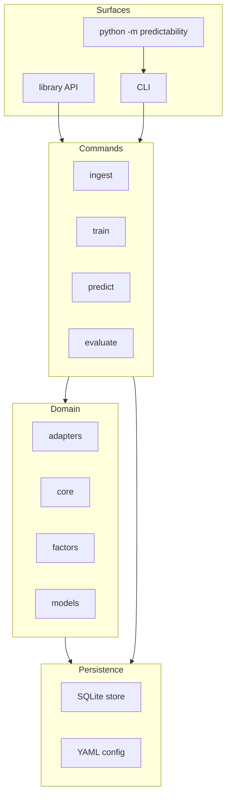
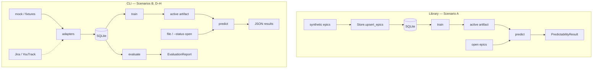

# Predictability Suite

Python library and CLI that estimates **team work predictability** from
epic-level deadline slip: first changelog due date vs actual completion.

v1 is a local library + CLI over SQLite. HTTP service is v2.

Spec: [`specs/001-team-work-predictability/spec.md`](specs/001-team-work-predictability/spec.md).
Constitution: [`.specify/memory/constitution.md`](.specify/memory/constitution.md).

Public functions use **Google-style** docstrings. Types live in signatures;
Pydantic models use `Field(description=...)`. [`docs/api.md`](docs/api.md) is the
mkdocstrings inventory (which modules to document). HTML is built separately:

```bash
pip install -e ".[docs]"
mkdocs serve
```

## Requirements

- Python 3.11+ (3.12 recommended)

## Install

```bash
python -m venv .venv
source .venv/bin/activate
pip install -e ".[dev]"
pre-commit install
```

Optional extras for model backends: `pip install -e ".[dev,catboost,gbm]"`.

## Library (Scenario A)

```python
from predictability import train, predict
from predictability.core.config import AppConfig

from predictability.core.synthetic import open_epic, two_team_history
from predictability.store.sqlite import Store

# Define storage
store = Store("predictability.sqlite")

# Two teams, 40 completed epics each; constant slip 12 vs 0 (not random).
store.upsert_epics(two_team_history(n_per_team=40, late_slip=12, ontime_slip=0))

cfg = AppConfig({"model": {"min_history": 5}})
train("empirical_bayes", "predictability.sqlite", config=cfg)

# Open epics for the same team ids (no completion date).
late, ontime = open_epic("late-team"), open_epic("ontime-team")

rows = predict("predictability.sqlite", epics=[late, ontime], config=cfg)
assert rows[0].on_time_probability < rows[1].on_time_probability
```

## CLI (Scenarios B, D–H)

v1 has `ingest`, `train`, `predict`, and `evaluate`. There is no `serve` command.

```bash
predictability ingest --adapter mock --query '{"seed": 42, "n_teams": 3, "n_epics": 1200}'
predictability train --backend empirical_bayes
predictability predict --file tests/fixtures/sample_open_epics.json
predictability predict --status open
predictability evaluate --backends empirical_bayes,quantile_catboost
```

- **B**: JSON on stdout; evaluate is walk-forward and does not change the active artifact. Missing CatBoost extra → that evaluate row errors; `empirical_bayes` still reports.
- **D**: Enable `capacity_calendar` / `cross_team_deps` in `config/default.yaml` (team vacation raises p90 slip; foreign blockers lower on-time probability).
- **E**: Register a custom adapter via the `predictability.adapters` entry point; ingest → train → predict without editing `core/` or `models/`.
- **F**: Unseen teams predict with `cold_start=true` until `min_history` completed epics exist.
- **G**: `evaluate` then `train --backend quantile_catboost` so the next `predict` `backend` is CatBoost. Evaluate alone must not swap the active artifact.
- **H**: Epics with no due changelog ingest as `deadline_source=current_fallback`.

Default `--db` is `./predictability.sqlite`. Skip Scenario C (`serve` / HTTP); that is v2.

Predictions are only valid for the factor set the artifact was trained with, so
`predict` refuses to score when the enabled factors, their versions, or their
params no longer hash to the artifact's `factor_set_hash`. Retrain after changing
factor config. Both `train` and `predict` fit factors on completed history, so an
open epic gets the same feature distribution the model learned from.

`slip_unit` and `min_history` are recorded on the artifact, so editing them in
config changes the *next* `train` rather than reinterpreting existing artifacts;
`predict` logs a warning and keeps scoring on the trained values.

## Quality gates

These run on every `git commit` via pre-commit, and on every push and pull
request via GitHub Actions. Run them yourself with:

```bash
ruff check src tests
ruff format src tests
python -m mypy
python -m pytest
pre-commit run --all-files
```

| Gate | Tool | Config |
|------|------|--------|
| Lint | Ruff | `pyproject.toml` `[tool.ruff]` |
| Format | Ruff | `ruff format` |
| Types | mypy (strict) | `[tool.mypy]` |
| Tests | pytest | `[tool.pytest.ini_options]` |
| Coverage | pytest-cov, ≥ 90% | pre-commit and CI |

Plain `python -m pytest` does not enforce coverage, so a single-file run during
red-green-refactor is not blocked by total coverage. The 90% threshold is
applied by the pre-commit hook and CI:

```bash
python -m pytest --cov=predictability --cov-report=term-missing --cov-fail-under=90
```

Local mypy/pytest hooks run through `scripts/venv-python`, which uses `.venv`
(or an active `VIRTUAL_ENV`) and fails loudly rather than falling back to a
system interpreter.

Whitespace hooks skip `.specify/` and `.cursor/skills/`: those are vendored
spec-kit assets tracked by hash in `.specify/integrations/*.manifest.json`.

Do not add a second Python linter or formatter. Tests are required for all
production code (constitution III). Default pytest MUST NOT call live trackers.

## Architecture

### Logical

What lives in the package. Arrows are **uses**, not data movement. Jira and YouTrack are outside this diagram; only ingest adapters talk to them.



### Data flow

Arrows are **data**. Library and CLI share one SQLite file. Dashed `Jira / YouTrack` is an optional live fetch (default ingest uses mock or fixtures). `evaluate` reads the same store and writes a report; it does not write the active artifact.



## License

MIT
